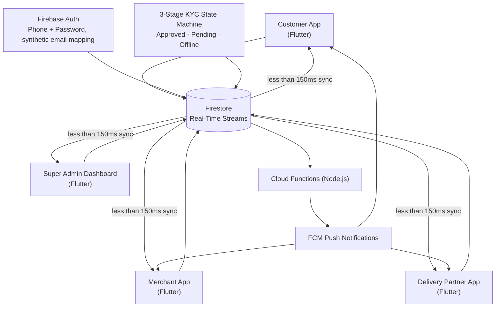

<div align="center">


<br/>

[](https://raushandubey.netlify.app/)
[](https://github.com/raushandubey)
[](https://www.linkedin.com/in/raushan-dubey01/)
[](mailto:raushandubey2005@gmail.com)
[](tel:+919934898643)

📍 India · Open to Relocation Worldwide · 🟢 Available Immediately

</div>

<br/>

## ⚡ Recruiter Snapshot

<div align="center">

| 🔌 15+ | ⚡ 30% | 🔄 &lt;150ms | 🤖 &lt;2s | 📱 5 | 🧠 150+ | 🏆 Top 25 | 🎓 7.8 |
|:---:|:---:|:---:|:---:|:---:|:---:|:---:|:---:|
| REST API endpoints shipped | API latency reduction | Real-time Firestore sync | AI response time (SLA) | Platforms shipped to (Pulse) | LeetCode problems solved | Code For Bharat S2 (national) | CGPA / 10 |

</div>

<p align="center"><sub>3 production software-engineering internships · 4-app real-time marketplace ecosystem · agentic AI pipeline in production · B.Tech CSE, Class of 2026</sub></p>

<br/>

## 🎮 About

Software Engineer who builds backend APIs, full-stack platforms, cross-platform mobile apps, and AI-integrated systems — and has shipped production-style projects across all four.

- **⚔ Backend →** Laravel / PHP 8.2, Node.js, REST API design, JWT + RBAC, service-layer architecture
- **🎨 Full-Stack →** React.js, Next.js, TypeScript, Tailwind CSS
- **📱 Mobile →** Flutter 3.x / Dart, shipped to iOS, Android, Web, Linux, and Windows from one codebase
- **🤖 AI →** OpenAI / Anthropic API integration, agentic pipeline orchestration, structured LLM outputs

Strong CS foundation: Data Structures & Algorithms · OOP · DBMS · Operating Systems · Computer Networks · System Design.

<br/>

## ⚔ Skill Tree

<table>
<tr><td width="170">⚔️&nbsp;<b>Backend</b></td><td>Laravel&nbsp;·&nbsp;PHP&nbsp;8.2&nbsp;·&nbsp;Node.js&nbsp;·&nbsp;Express.js&nbsp;·&nbsp;REST&nbsp;APIs&nbsp;·&nbsp;JWT&nbsp;·&nbsp;RBAC&nbsp;·&nbsp;Eloquent&nbsp;ORM&nbsp;·&nbsp;Sanctum&nbsp;Auth</td></tr>
<tr><td>🎨&nbsp;<b>Frontend</b></td><td>React.js&nbsp;18&nbsp;·&nbsp;Next.js&nbsp;14&nbsp;·&nbsp;TypeScript&nbsp;·&nbsp;JavaScript&nbsp;(ES6+)&nbsp;·&nbsp;Tailwind&nbsp;CSS&nbsp;·&nbsp;Bootstrap&nbsp;5&nbsp;·&nbsp;HTML5&nbsp;·&nbsp;CSS3</td></tr>
<tr><td>📱&nbsp;<b>Mobile</b></td><td>Flutter&nbsp;3.x&nbsp;·&nbsp;Dart&nbsp;3.9&nbsp;·&nbsp;Riverpod&nbsp;2&nbsp;·&nbsp;GoRouter&nbsp;14&nbsp;·&nbsp;Dio&nbsp;5&nbsp;·&nbsp;CustomPainters&nbsp;·&nbsp;Firebase&nbsp;(Firestore&nbsp;·&nbsp;Auth&nbsp;·&nbsp;Cloud&nbsp;Functions&nbsp;·&nbsp;FCM&nbsp;·&nbsp;Hosting)</td></tr>
<tr><td>🤖&nbsp;<b>AI</b></td><td>OpenAI&nbsp;API&nbsp;·&nbsp;Anthropic&nbsp;API&nbsp;·&nbsp;OpenRouter&nbsp;·&nbsp;LLM&nbsp;Orchestration&nbsp;·&nbsp;Agentic&nbsp;Pipeline&nbsp;Design&nbsp;·&nbsp;Prompt&nbsp;Engineering</td></tr>
<tr><td>💾&nbsp;<b>Database</b></td><td>MySQL&nbsp;·&nbsp;PostgreSQL&nbsp;·&nbsp;MongoDB&nbsp;·&nbsp;Redis&nbsp;·&nbsp;Firestore&nbsp;·&nbsp;Query&nbsp;Optimisation&nbsp;·&nbsp;Schema&nbsp;Design</td></tr>
<tr><td>☁️&nbsp;<b>Cloud&nbsp;/&nbsp;DevOps</b></td><td>AWS&nbsp;(EC2&nbsp;·&nbsp;S3&nbsp;·&nbsp;IAM&nbsp;·&nbsp;RDS&nbsp;·&nbsp;Lambda)&nbsp;·&nbsp;Docker&nbsp;·&nbsp;GitHub&nbsp;Actions&nbsp;CI/CD&nbsp;·&nbsp;Linux</td></tr>
<tr><td>🧪&nbsp;<b>Testing</b></td><td>PHPUnit&nbsp;·&nbsp;Postman&nbsp;·&nbsp;A/B&nbsp;Testing&nbsp;·&nbsp;Cross-browser&nbsp;Testing&nbsp;·&nbsp;Regression&nbsp;Testing</td></tr>
<tr><td>🏗️&nbsp;<b>Architecture</b></td><td>System&nbsp;Design&nbsp;·&nbsp;State&nbsp;Machine&nbsp;Design&nbsp;·&nbsp;Event-driven&nbsp;Architecture&nbsp;·&nbsp;SOLID&nbsp;Principles&nbsp;·&nbsp;DSA</td></tr>
<tr><td>🧰&nbsp;<b>AI&nbsp;Dev&nbsp;Tools</b></td><td>Claude&nbsp;Code&nbsp;·&nbsp;Cursor&nbsp;·&nbsp;GitHub&nbsp;Copilot&nbsp;·&nbsp;OpenAI&nbsp;Codex&nbsp;·&nbsp;Windsurf&nbsp;·&nbsp;Aider&nbsp;·&nbsp;ChatGPT&nbsp;·&nbsp;Agentic&nbsp;AI&nbsp;Workflows</td></tr>
</table>

<div align="center">

</div>

<br/>

## 🚀 Featured Projects

### 🛒 LocalKart — Multi-Tenant Hyperlocal Marketplace
`Flutter 3.x · Dart · Riverpod 2 · GoRouter 14 · Firebase (Firestore · Auth · Cloud Functions · FCM · Hosting)`

4 independent Flutter applications — Customer, Merchant, Delivery Partner, and Super Admin Dashboard — sharing one Firestore backend.

```
Customer · Merchant · Delivery · Admin  →  Firestore (real-time streams)  →  Cloud Functions  →  FCM
```

- Real-time cross-app state sync at **&lt;150ms** latency across all roles simultaneously
- Custom Phone + Password auth over Firebase Auth (synthetic email mapping) — no SMS OTP cost, no third-party auth SDK
- 3-stage delivery-partner KYC pipeline (Approved · Pending · Offline) via Firestore transaction batch writes — zero data corruption under concurrent writes
- 15-second countdown order-invitation modal + custom Bezier-path route visualisation via Flutter CustomPainters
- Deployed to iOS, Android, and Web from a single Dart codebase

[](https://github.com/raushandubey/LocalKart)
[](https://message-23b1d-a8e7b.web.app/)
[](https://message-23b1d-store.web.app/)
[](https://message-23b1d-delivery.web.app/)
[](https://message-23b1d.web.app/)

<br/>

### 💬 Pulse — Cross-Platform Messaging App
`Flutter 3.x · Dart · Firebase Firestore · Cloud Functions (Node.js) · FCM · APNs`

Real-time messaging shipped across **5 platforms** — iOS, Android, Web, Linux, and Windows — from one Flutter codebase.

```
Client  →  Firestore real-time streams (sub-100ms)  →  Cloud Function (Node.js)  →  FCM / APNs / Web Push  →  Client
```

- Sub-100ms message delivery via Firestore real-time streams; multi-device sign-in via Firebase Auth
- Production Node.js Cloud Function (Firestore `onCreate` trigger) resolves FCM tokens and dispatches platform-specific push — high-priority channel for Android, APNs for iOS, Web Push for browser
- 3-state notification handling: foreground overlay with active-chat suppression, background system-tray routing, terminated-state cold start via `getInitialMessage()`
- `MockNotificationService` offline fallback — full app demo with zero external API calls when Firebase credentials are absent

[](https://github.com/raushandubey/Cross-Platform-Messaging-App)
[](https://message-23b1d.web.app/)

<br/>

### 🤖 Student Internship Hub — Agentic AI Career Platform
`Laravel · PHP 8.2 · MySQL · OpenAI API · Redis · Docker · GitHub Actions · Flutter (mobile client)`

Role-based hiring platform with an autonomous LLM pipeline, plus a companion cross-platform mobile app.

```
Candidate Profile  →  Laravel Service Layer  →  Agentic OpenAI Pipeline  →  Structured Career-Fit Score (<2s)
```

- 5-stage event-sourced hiring state machine (Applied → Under Review → Shortlisted → Interview → Decision) with full audit logging
- Autonomous agentic AI pipeline via the OpenAI API returns structured career-fit scores and guidance in **&lt;2 seconds**
- Redis caching cut repeat DB reads by **~40%**; Docker + GitHub Actions CI/CD enforces automated test gates on every push
- PHPUnit test suite across all service-layer classes (AI pipeline, hiring state machine, recruiter dashboard, candidate evaluation)
- Companion Flutter app (iOS & Android): JWT auth via Dio 5 interceptors, role-based GoRouter navigation (Student vs Recruiter)

[](https://github.com/raushandubey/Student-Internship-Hub-system)
[](https://student-internship-hub-system-master-bzcojt.free.laravel.cloud/login)
[](https://github.com/raushandubey/Student-Internship-Hub-Application)
[](https://raushandubey.itch.io/student-internship-hub-ai-career-platform)

<br/>

### 🎯 AdFit AI — Ad-to-Landing-Page Fit Analyzer
`Next.js 15 · TypeScript · Prisma ORM · PostgreSQL (Neon) · Node.js Crypto · Zod`

```
URL Input  →  DNS-Resolution Validation  →  Cheerio Crawler  →  LLM Fit Analysis  →  Structured Score
```

- Custom cookie auth built on native Node.js `crypto` (scrypt + AES-256-GCM) — avoided OS-dependent build issues
- Dual-database layer (Prisma + Neon PostgreSQL) with automatic JSON fallback for offline testing
- SSRF protection via DNS-resolution checks in the Cheerio crawler, rejecting loopback / private-subnet requests

[](https://github.com/raushandubey/-Ad-to-Landing-Page-Fit-Analyzer-Helium-Build-assignment-Software-Engineer)
[](https://ad-to-landing-page-fit-analyzer-hel.vercel.app/)

<br/>

### 📅 Bhaktinama — Appointment Scheduling Platform
`Laravel · PHP · MySQL · Blade · JavaScript · Payment Gateway · Laravel Guards · Redis`

```
User  →  Booking Service (5-state workflow)  →  Payment Gateway  →  Admin / Provider Dashboard
```

- 5-state booking workflow (Created → Confirmed → Rescheduled → Completed → Cancelled) with end-to-end payment processing
- 3-role access control (Admin · Service Provider · User) via Laravel Guards with route-level middleware
- Redis session caching on high-frequency booking-availability endpoints for concurrent request handling

[](https://github.com/raushandubey/Bhaktinama-2)
[](https://bhaktinama.com/)

<br/>

## 🗺️ System Architecture — LocalKart



<br/>

## 🏗️ Experience

<table>
<tr>
<td width="230" valign="top"><b>Trapigo</b><br/>Backend Engineer Intern<br/><sub>Jun 2025 – Sep 2025 · Bangalore · On-site</sub></td>
<td valign="top">

`Laravel · PHP 8.2 · MySQL · Redis · JWT`
- Shipped **15+ production REST API endpoints** for Flutter mobile and React web clients
- Cut average API latency by **30%** via N+1 elimination, eager loading, and MySQL indexing
- Implemented JWT auth + RBAC middleware; authored PHPUnit tests enforcing Controller → Service → Model separation
- Configured Redis session caching on high-frequency endpoints, reducing repeat DB reads

</td>
</tr>
<tr>
<td valign="top"><b>Ceeras</b><br/>Frontend Engineer Intern<br/><sub>Feb 2025 – Jun 2025 · Remote</sub></td>
<td valign="top">

`React.js · Node.js · REST APIs`
- Delivered **6+ production React.js feature modules** from Figma specs
- Cut design-to-implementation cycle time by **25%** via reusable component architecture
- Applied lazy loading, memoisation, and code splitting — improved Lighthouse scores
- Maintained zero regression across 3 major releases through systematic integration testing

</td>
</tr>
<tr>
<td valign="top"><b>BlueStock Fintech</b><br/>Software Development Intern<br/><sub>Feb 2025 – Mar 2025 · Pune</sub></td>
<td valign="top">

`Figma · HTML5 · CSS3 · JavaScript`
- Prototyped fintech UI/UX in Figma; contributed to core trading-interface implementation
- Ran A/B tests across **3 user conversion flows**, improving task-completion rates on onboarding

</td>
</tr>
</table>

**Additional:** Technical Recruitment Analyst at **Vizva Consultancy Services** (US Technology Market, Dec 2025 – Apr 2026) — evaluated technical competencies of 50+ software engineers (Java · .NET · Python · DevOps) and built structured assessment frameworks for enterprise client submissions.

<br/>

## 🏆 Achievements & Education

- 🏆 **Top 25 Teams** — Code For Bharat Season 2 (national-level software engineering hackathon, India)
- 🧠 **150+ LeetCode problems** solved — Arrays · Hash Maps · Strings · Recursion · Two Pointers
- 📜 **Certificate of Participation** — TATA Crucible Campus Quiz 2024
- 🎓 **B.Tech Computer Science Engineering** — Gopal Narayan Singh University, Bihar, India (2022 – 2026) · CGPA **7.8 / 10**
- Core coursework: Data Structures & Algorithms · OOP · DBMS · Operating Systems · Computer Networks · System Design · Compiler Design

<br/>

## 📊 GitHub Activity

<div align="center">


</div>

<br/>

## 🎯 Current Focus

<div align="center">

</div>

<br/>

## 📬 Let's Build

<div align="center">

**Open to Software Engineering Opportunities — Available Immediately · Open to Relocation Worldwide**

[](https://raushandubey.netlify.app/)
[](https://github.com/raushandubey)
[](https://www.linkedin.com/in/raushan-dubey01/)
[](mailto:raushandubey2005@gmail.com)
[](tel:+919934898643)


</div>
